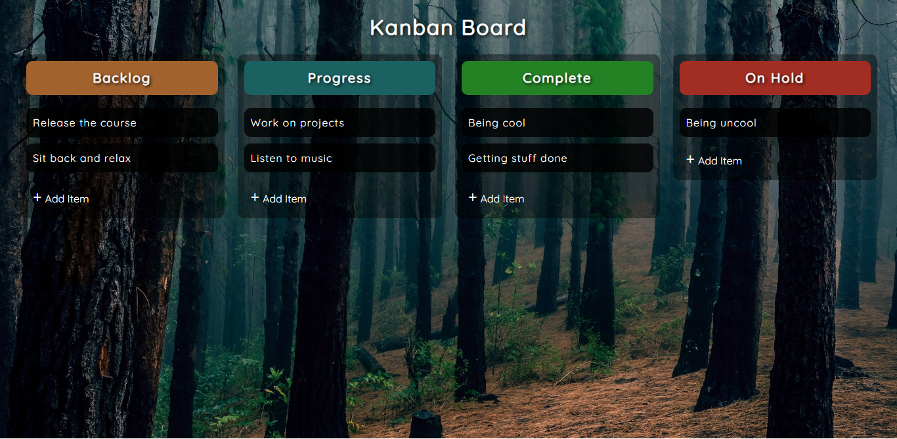

<h1>Drag and Drop</h1>

<h2>A drag and drop task board created using HTML, CSS, and JavaScript.</h2>

This task board was created using HTML, CSS, and JavaScript that lets you create tasks, move them to different sections and delete the tasks. Screenshot of the task board. Works with Chrome.

- Live Site: [Drag and Drop](https://drag-drop-tutorial.netlify.app/)

### Screenshot

